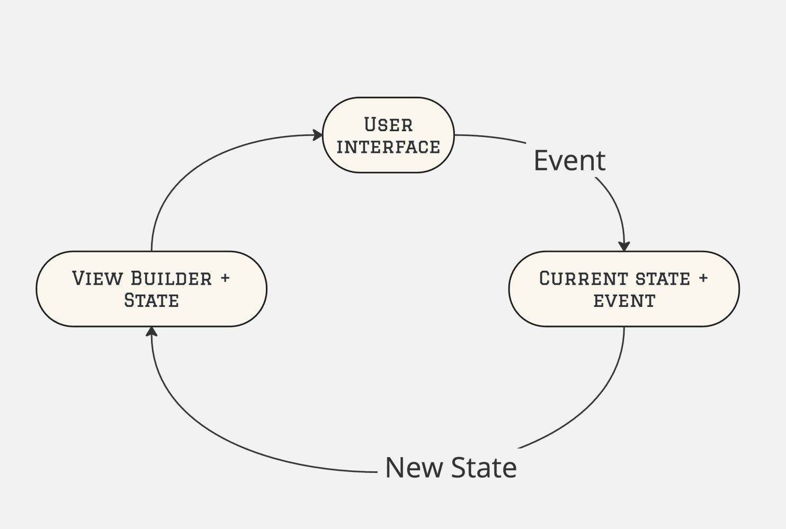
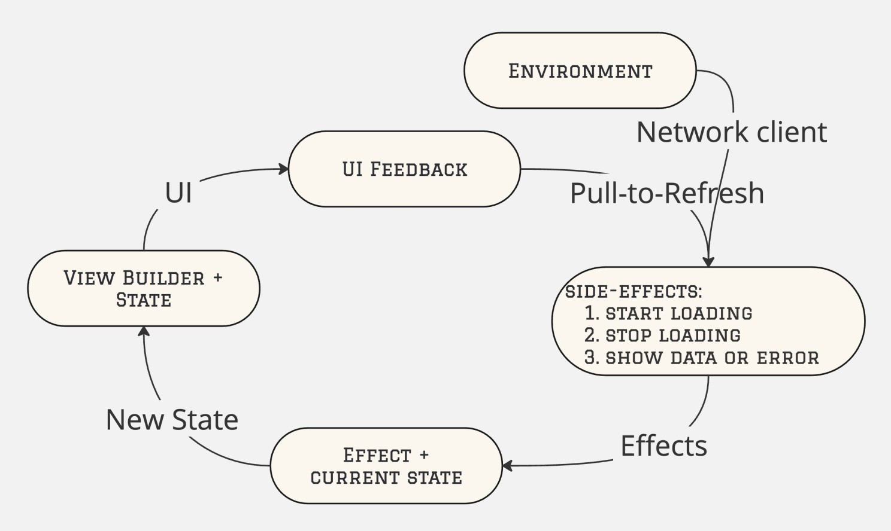
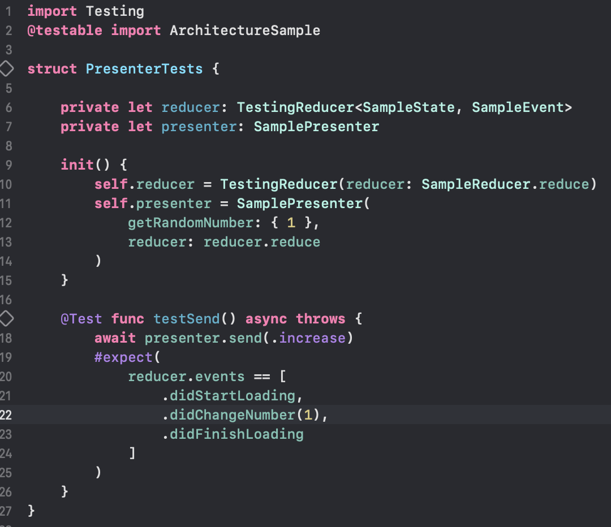
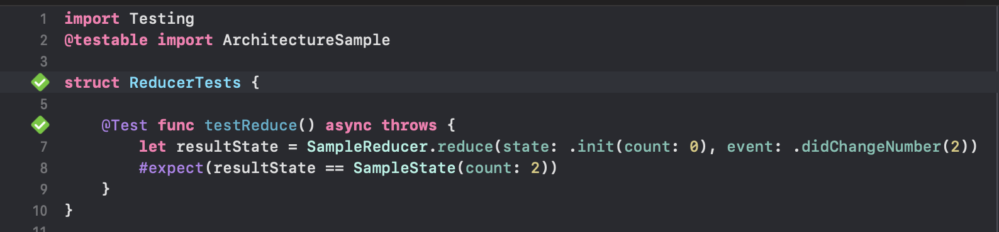
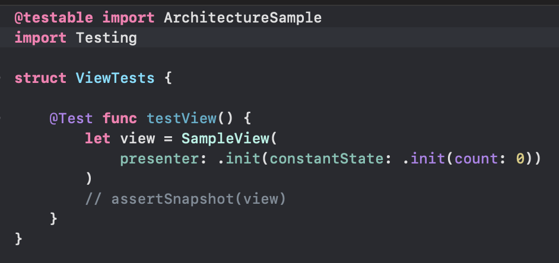
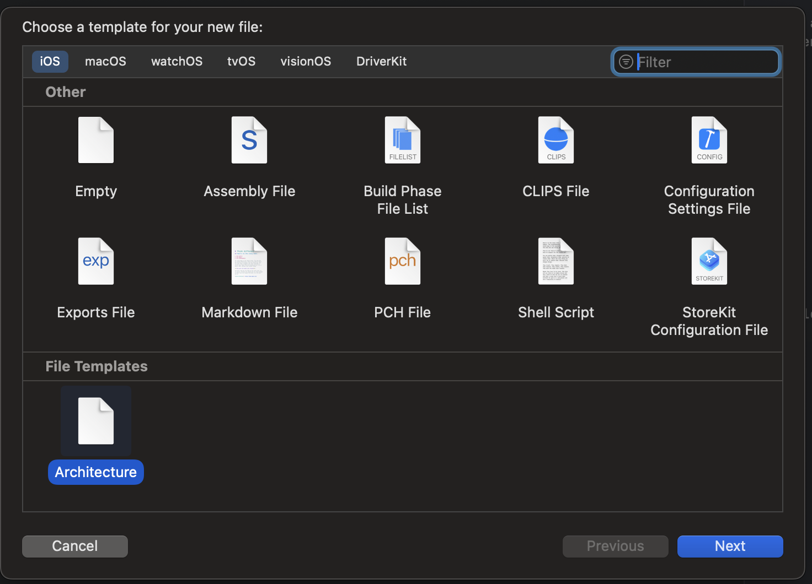

# Key concepts

Let’s define what good architecture for the app actually means. There are many slightly different opinions about it, but in common it usually focuses on the
following set of requirements:

- Easy to read and understand
- Easy to reuse, extend, and scale
- Easy to test and tests are cheap
- Easy to debug, fix, and maintain
- Ease to onboard new developers

There are many easy, so the solution should be laconic with minimum boilerplate code and not be overengineered, otherwise it is hard to call it an easy one.
Simultaneously, it should be very efficient in terms of the development process. And I’d add one more important quality - solidity, architecture should be
rigid enough to resist being used inappropriately. For example, MVC is extremely easy to use incorrectly, and that is why we have the anti-pattern “Massive
ViewController” (instead of “Model-View-Controller”). Good architecture has to protect itself and the principles it is based on.

# Modern software is a Teamwork

All modern competitive mobile apps are developed by teams.

Teamwork means the app must allow parallel development and must do it easily. It also means that each part of the app is developed by many developers. It leads
that the architecture must have strong rules about where each specific part of code must be located and how implemented. Also, the architecture must have a
high level of consistency, otherwise, one developer will not be able to continue another developer’s work. Taking it all into account, the architecture must
provide an exceptional level of testability. In the case of intensive development, the architecture should also provide a good level of horizontal scalability
without increasing the cognitive load for reading and understanding the codebase. 

# The problems of popular patterns

Architecture is a kind of tradeoff, and there are consequences. Such architectural patterns like MVC, MVP, and MVVM are very simple and it’s easy to start to
use them just after short learning. But the other side of this simplicity is these patterns describe a common approach of segregation codebase only and could
be understood and implemented very differently. As a result, each team has its own rules on how they try to keep a separation between layers, and these rules
could usually be (in practice this means most likely will be) broken quite easily. A typical problem of these patterns is a massive business logic layer, which
is hard to test properly because, without clear boundaries between layers, it tends to use service layers and other entities directly without dependency
injection.

# The Elm architecture

The Elm architecture is well known in web development, but rarely considered for something else, including mobile development. Obviously, it’s not possible to
use an architecture that was developed for the web in mobile development as it is. However, it is possible to take out the best ideas, extend them according to
mobile specifics, and implement a working prototype. 

What is the Elm architecture in a nutshell?

Any Elm program is always split into the following:

- Model, that keeps the current state of the app
- View, which converts the Model to the User Interface (UI)
- Message, which is an event that comes from the UI to Update
- Update, which produces a new Model, based on a Message

Based on this, there are a few very important consequences:

- Model, it’s usually named State in mobile development, - the single source of truth that keeps everything needed to represent the current state of the app or
the current screen or whatever 
- View, in mobile development, it’s rather View Builder, which is a pure function, that has the State as an input and the User Interface as the output
- Messages or Actions is a limited set, that a user (or another part of the app) can send, and a keyword here is limited, so it’s just impossible that something
unpredictable can come
- Update function or Reducer is a pure function, that has a current state and new event as an input and a new state as output; this is the only place where a
state can be changed

In practice, any part of the app works in collaboration with others, not in a vacuum, and it also has some dependencies, all this together — a kind of
Environment. Additionally, each event can produce a few side effects that will change the state. In fact, a new state is just a result of applying the side
effects of an event to the current state. And we need some mechanism to get any events from the User interface, an abstraction that will produce the user’s
events - "UI Feedback".

So let's see how does this architecture works on a real example:
The user press the button to load some data -> View send action "Load data" to Reducer. The Reducer will produce a first side effect - "Loading did start" and
make a request to get new data. Then, when the request is finished, Reducer produces the second side effect - "Loading did stop". The third side-effect will
depend on the result of the request, if it is a success then Reducer produces the "New data did come" effect, otherwise, it will be the "Error did occur"
effect. Each effect will be applied to the current State and after each state’s changes, View Builder generates an updated actual UI for the user.

It could look a bit complicated at the very first glance, but it’s very easy to use in practice because we have a limited set of particular entities, and every
one of them is responsible only for one specific task. There is a unidirectional flow, so it’s easy to follow it and understand what is going on. Most of the
logic is pure functions, one single source of truth, and business and presentation logic are strongly separated. Taking this all into account, this approach
has a fantastic level of testability.

To confirm this, you can look at the ArchitectureSampleTests folder, which demonstrates how easily (in just a few lines) each component of this architecture
can be tested. It shows what events are triggered by actions, how the reducer changes the state based on events, and, importantly, how easy it is to test the
view—since we’ve maintained the principle that the view is a function that receives state and produces UI

## Presenter tests

## Reducer tests

## View tests

For generating new module you can use Architecture.xctemplate. Just paste it in
/Applications/Xcode.app/Contents/Developer/Platforms/iPhoneOS.platform/Developer/Library/Xcode/Templates/File\ Templates
And use like this command+N

